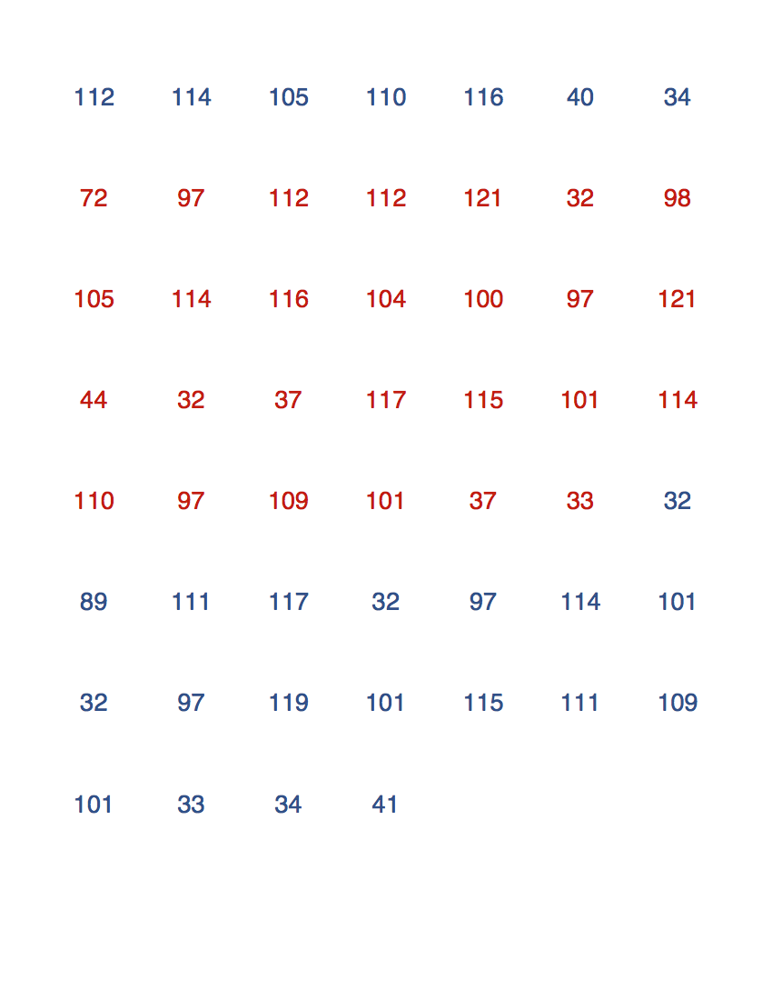

Say \72\97\112\112\121 \32\98\105\114\116\104\100\97\121 to your geek friend!
===============================================================================

## Usage

Use `{}` markup to highlight a part of text with a different color.

```bash
./make-pdf.rb -t 'print("{Happy birthday, %username%!} You are awesome!")'
              -b '0D4F8B'
              -c 'E3170D'
              -o 'postcard.pdf'
```

Will generate you the following [postcard](examples/postcard.pdf).


